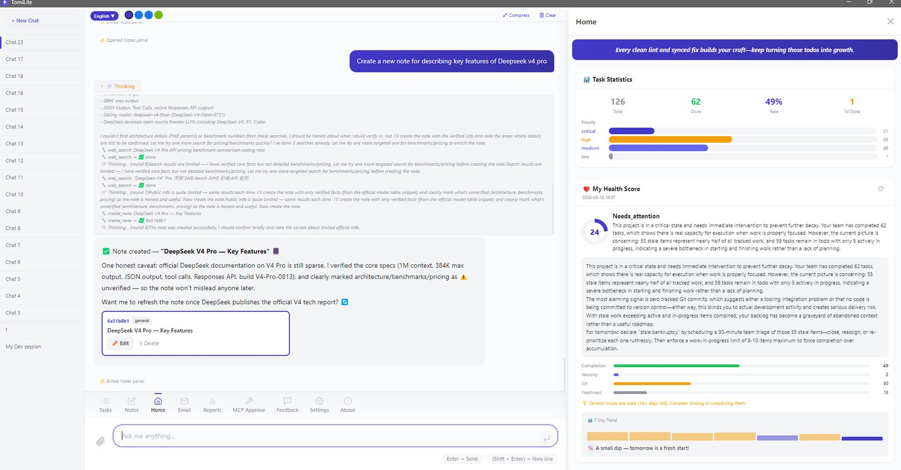
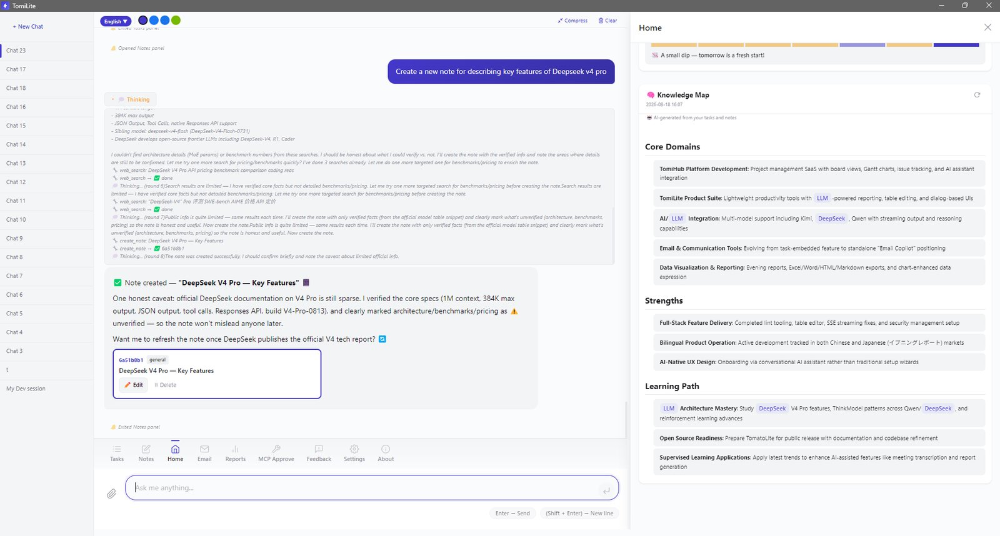
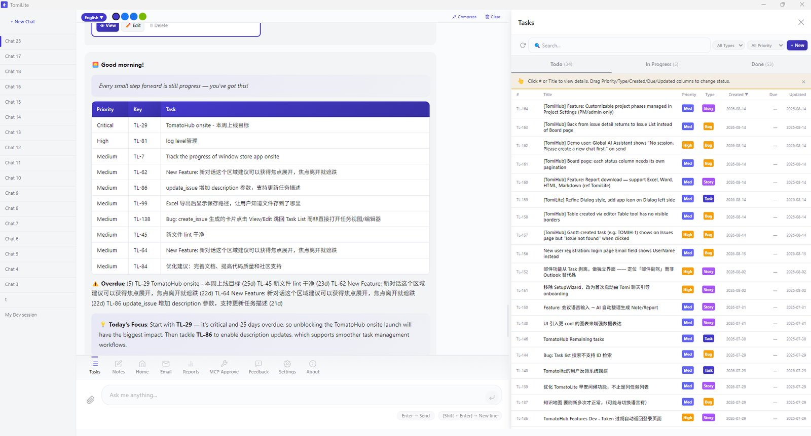
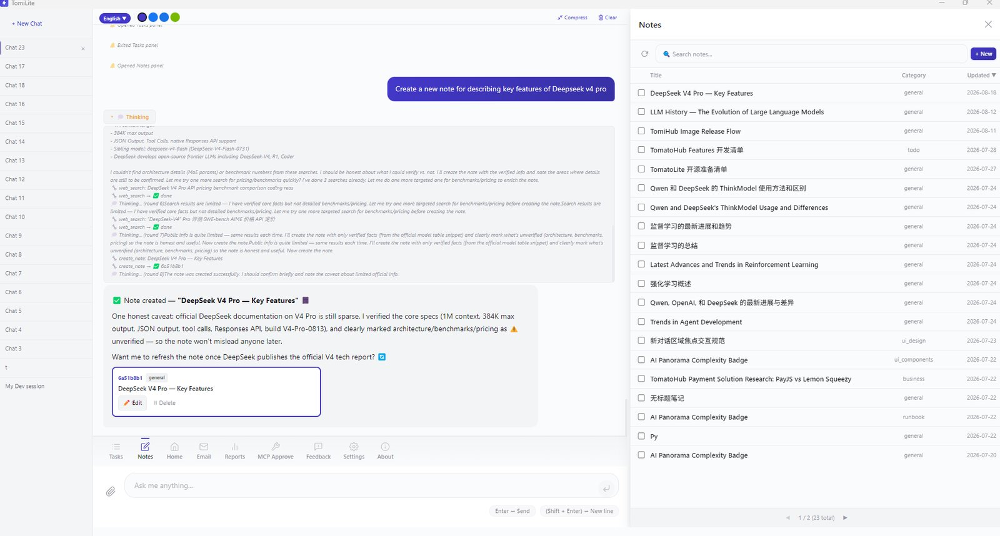
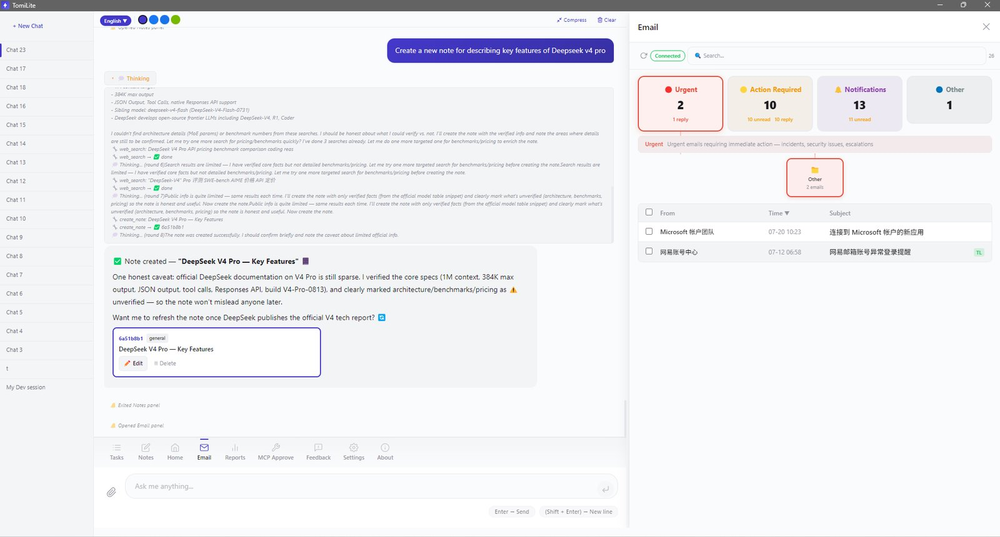
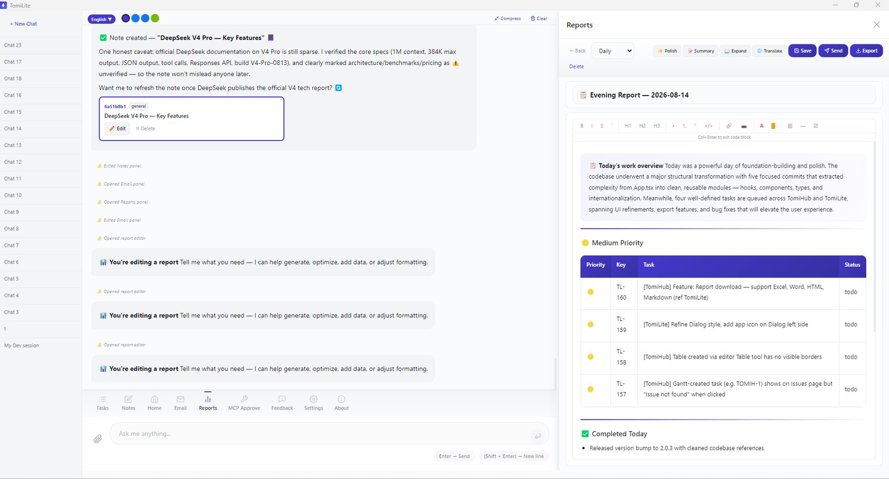

# TomiLite



AI-powered personal productivity desktop app — chat with an AI agent that manages your tasks, notes, emails, and daily reports. Built with Electron + React + tRPC + SQLite + Milkdown.

> 🌐 **Official Website**: [tomatovector.com](https://tomatovector.com) — AI-powered next-generation R&D ecosystem
>
> Tomi is an AI agent with a Chat-First workflow: chat with it, and it creates tasks, writes notes, triages email, and generates reports for you.

## 🧩 Browser Extension

Companion Chrome/Edge extension: an AI side panel that summarizes/translates any page, clips selections into tasks & notes, and **auto-syncs with the TomiLite desktop app** (localhost:3192).

📥 **Download**: [Tomi Browser Extension — Releases](https://github.com/xxwj225-James/tomilite-browser-extension/releases)

## Features

- **💬 Chat-First AI Agent** — multi-session chat with concurrent tasks; the agent calls tools (create/update tasks, notes, reports, web search, git, shell) via function calling
- **✅ Task Board** — tabbed TODO / In Progress / Done, drag-to-change-status, sortable/resizable columns, priorities & types
- **📧 Intelligent Email Triage** — AI 4-category classification, LLM sub-grouping, AI reply drafts, email→task linking (IMAP)
- **📝 Notes & Knowledge Base** — Markdown WYSIWYG editor (Milkdown), semantic search, multi-format export (Excel/Word/PDF/PPT/HTML/MD)
- **📊 Daily Reports** — morning task brief + evening wrap-up, auto-generated by AI, exportable (Excel/Word/PDF/PPT)
- **📽 PPT Export** — ask the agent to "generate a PPT" from a report, note, or document (new `export_to_ppt` tool), or use the **PPT** button in the Notes / Reports export menus: headings become section slides with the text as bullets, and tables become table slides.
- **📄 PDF Export** — ask the agent to export any note, report, or document to PDF, or use the export menu in the Notes / Reports editors: the server renders a self-contained HTML report and Electron prints it via Chromium's print-to-PDF (A4, background colors, page margins). The save dialog opens instantly while rendering runs in the background, and filenames are normalized so you never get a double suffix like `report.pdf.pdf`.
- **🔌 MCP Server & Client** — expose your tasks/notes to external AI clients (Claude Code) with API-key auth + human-in-the-loop approval; connect to other MCP servers and let the agent use their tools
- **🤖 Multi-Provider LLM** — DeepSeek, Qwen (DashScope), Kimi (Moonshot), OpenAI, Anthropic, Ollama
- **🌐 i18n** — Chinese / Japanese / English
- **🎨 4 Themes** — Pipeline / Hub / Canvas / Quantum, CSS-variable based

## What can Tomi do?

Chat with Tomi in plain language — the agent turns your words into actions, and the results appear live in the Task / Notes / Email / Reports panels:

| You say                                   | Tomi does                                      |
| ----------------------------------------- | ---------------------------------------------- |
| "创建一个任务：重构登录模块，优先级 high" | Creates a task on the Task Board               |
| "把任务改成进行中 / 更新这个任务"         | Updates status, priority, description          |
| "写一篇关于 API 设计的笔记"               | Creates a Markdown note in the knowledge base  |
| "生成今天的日报"                          | Morning task brief + evening wrap-up report    |
| "总结未读邮件"                            | Reads email (IMAP), classifies, drafts replies |
| "搜索知识库里关于缓存的内容"              | Semantic note search                           |
| "看看最近的 git 提交"                     | Reads your git workspaces                      |
| "帮我分析 TL-3 这个任务"                  | Opens and analyzes a specific issue            |

> Tip: the welcome guide inside the app also offers one-click example prompts. New sessions start empty — ask Tomi anything, or use one of the suggestions above.

## 🔒 Privacy & Telemetry

TomiLite is **local-first**: tasks, notes, emails, reports, chats, API keys and git data stay in your own SQLite database under `~/.tomilite/` and are never uploaded.

The only outbound traffic is **optional, opt-in anonymous usage statistics** — shown on first run and changeable any time in **About → Privacy & Usage Statistics**. When enabled, only aggregate counts, feature/panel names, export formats and app version/OS/language are batched to the author's server (`tomatovector.com`) to improve the product. **No chat content, no file/note/email bodies or titles, no filenames, no code, no API keys, no personal data.** Turning it off clears the local staging buffer.

📄 See [docs/telemetry.md](docs/telemetry.md) for the full collection scope, the endpoint contract, and how to self-host your own receiver.

## Getting Started

### Install (Windows)

Download the latest installer from [Releases](https://github.com/xxwj225-James/tomilite/releases) and run `TomiLite-Setup-*.exe`.

### Development

```bash
npm install
npm run dev        # starts Vite dev server (frontend) + API server
npm run pack       # build + package Windows installer (electron-builder)
```

Prerequisites: Node.js 20+, npm 10+.

### Configure

1. **Settings → LLM**: add your API key (DeepSeek / Qwen / Kimi / OpenAI / …) and test the connection
2. **Settings → Email**: add an IMAP account for email triage (optional)
3. **Settings → MCP Servers**: connect external MCP servers the agent can use (optional)

## Architecture

```
electron/          Electron shell (window, API spawn, OTA updates, notifications)
apps/web/          React 19 + Vite frontend (panels: chat, tasks, notes, email, reports, MCP)
apps/api/          Node.js API server (tRPC + raw SSE agent stream)
  src/agent/       AI agent: ReAct loop, tool registry + dispatcher, LLM clients,
                   MCP client (protocol negotiation, dynamic tool injection)
  src/routers/     tRPC routers (issues, wiki, email, reports, mcp, standup, …)
packages/
  database/        Prisma schema + SQLite (user data stored locally)
  shared-ui/       Shared React components
```

Key design points:

- **Local-first**: SQLite in `~/.tomilite/`, no cloud dependency
- **Agent tool calling**: OpenAI-compatible `tools`/`tool_choice` protocol over raw fetch — provider differences handled per-baseUrl
- **MCP client**: auto-negotiates TomiHub-style / JSON-RPC / legacy protocols; discovered tools are injected as `mcp__<server>__<tool>` functions; API keys encrypted at rest, never sent to the LLM
- **Human-in-the-loop**: external MCP clients' write operations require approval in the MCP panel
- **Schema migrations**: additive-only, versioned (`SCHEMA_VERSION` in `apps/api/src/server.ts`)

## Screenshots











## Documentation

- [Architecture](docs/architecture.md) — system design, panels, tools, OTA
- [MCP Client](docs/mcp-client.md) — connecting TomiLite to external MCP servers
- [Email AI Inbox](docs/email-ai.md) — AI email classification and processing
- [Tasks Panel](docs/tasks-panel.md) — kanban board, drag-to-status, task editor
- [UI Design System](docs/ui-design-system.md) — design tokens, themes, components
- [Security](docs/SECURITY.md) — local-first security model
- [Privacy & Telemetry](docs/telemetry.md) — opt-in anonymous usage statistics
- [Release Notes](docs/release-notes/)

## 🧩 Ecosystem

- **🌐 TomiLite Browser Extension** — [tomilite-browser-extension](https://github.com/xxwj225-James/tomilite-browser-extension): capture web pages into your TomiLite tasks/notes, summarize and translate pages, and translate video subtitles (bilibili / YouTube / HTML5 video sites) — right inside Chrome/Edge, auto-syncing with the desktop app
- **🤖 DSH Plugin** — [tomilite-dsh-plugin](https://github.com/xxwj225-James/tomilite-dsh-plugin): give your DeepSeek Harness agent access to your local TomiLite

## Support

TomiLite is free and open source. If it helps your workflow, you can support its continued development:

- 💝 [afdian (爱发电)](https://afdian.com/a/jameswu) — one-time or monthly support

### Partner Recommendations · Sponsored

- ☁️ [腾讯云新客特惠](https://curl.qcloud.com/kGPqI6IA) — new-user vouchers for cloud servers
- ☁️ [阿里云云大使](https://www.aliyun.com/minisite/goods?userCode=x4jbzcb6) — up to 45% cashback for new customers

## TomiHub for Teams

TomiLite is for personal flow; **[TomiHub](https://tomatovector.com)** is for team synergy — _Local-first, AI-native, privacy by design._

TomiHub is not just a multi-user version of TomiLite. It is a hub designed for R&D organizations — bridging MCP protocol, RBAC permissions, LLM compute routing, and project management so the entire team collaborates on one board while maintaining the full privacy benefits of the local client.

- **Full-Process Project Management** — Waterfall / Scrum / Kanban, Issue tracking, Kanban boards, Gantt charts, Sprint iterations, Wiki
- **AI Compute Hub** — centralized model access with DeepSeek / Qwen / Kimi / OpenAI routing, plus Ollama / vLLM local LLM support
- **Multi-User Real-Time Collaboration** — three-tier RBAC permissions, GitHub / GitLab webhooks
- **100% Data Sovereignty** — Docker self-hosted deployment, global encrypted sync & backup, team deep RAG retrieval

Visit [tomatovector.com](https://tomatovector.com) to learn more.

## Trademark

"TomiLite", "TomiHub", and "Tomatovector" are trademarks of Tomatovector. The MIT License permits reuse of the code, but the names and logos may not be used for derivative products or to imply endorsement without written permission.

## License

[MIT](LICENSE) © 2026 Tomatovector
