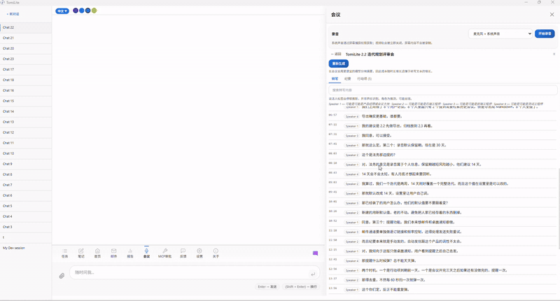

# TomiLite

**Your AI can finally act on your real work — not just chat about it.**

TomiLite is a local-first desktop AI workspace. You talk in plain language, and the agent creates tasks, writes notes, triages email, records and summarizes meetings, and generates reports — against your own data, stored in a local SQLite database on your machine.

[](LICENSE)
[](https://github.com/xxwj225-James/tomilite/releases/latest)
[](#install-windows)

**[⬇ Download for Windows](https://github.com/xxwj225-James/tomilite/releases/latest)** · [What Tomi can do](#what-can-tomi-do) · [Features](#features) · [Documentation](docs/) · [Website](https://tomatovector.com)

<!-- TODO: hero demo GIF — record a short clip of: type "创建一个任务：重构登录模块" → the task appears on the board. (The meeting demo GIFs already live in the section below.) -->


## Why TomiLite?

AI can answer anything. It just doesn't know **what you're working on**.

TomiLite gives your AI a persistent workspace — your tasks, notes, knowledge base, email and meetings — so it acts on your actual context instead of guessing at it.

## 🎙 Meetings that never leave your machine

Record a meeting, and get minutes with action items — without the audio ever being uploaded:



1. **Record** — microphone + system audio mixed into one track
2. **Transcribe locally** — the bundled [whisper.cpp](https://github.com/ggml-org/whisper.cpp) binary does the speech-to-text on your machine: no API call, no upload
3. **Summarize with AI** — summary, decisions and action items, with honest `Speaker 1/2/3` labels (no invented names, because no voice-print identification is performed)
4. **Act on it** — one click turns any action item into a task on your board; minutes can be emailed through your own SMTP

Most meeting-AI tools upload your audio and bill by the minute. TomiLite's audio never leaves your computer — only the transcript text reaches your LLM, and only when you ask for a summary. Recording and transcription work even with **no LLM configured at all**.

→ [How meetings work](docs/meetings.md)

## What can Tomi do?

Chat with Tomi in plain language — the agent turns your words into actions, and the results appear live in the Task / Notes / Email / Reports panels:

| You say                                   | Tomi does                                      |
| ----------------------------------------- | ---------------------------------------------- |
| "创建一个任务：重构登录模块，优先级 high" | Creates a task on the Task Board               |
| "把任务改成进行中 / 更新这个任务"         | Updates status, priority, description          |
| "写一篇关于 API 设计的笔记"               | Creates a Markdown note in the knowledge base  |
| "生成今天的日报"                          | Morning task brief + evening wrap-up report    |
| "总结未读邮件"                            | Reads email (IMAP), classifies, drafts replies |
| "搜索知识库里关于缓存的内容"              | Semantic note search                           |
| "看看最近的 git 提交"                     | Reads your git workspaces                      |
| "帮我分析 TL-3 这个任务"                  | Opens and analyzes a specific issue            |

> Tip: the welcome guide inside the app also offers one-click example prompts. New sessions start empty — ask Tomi anything, or use one of the suggestions above.

## Features

| Feature | What it does |
| ------- | ------------ |
| 🎙 **Local meeting notes** | Record → local whisper.cpp transcription → AI minutes & action items → one-click task. Audio never leaves your machine |
| 💬 **Chat-first AI agent** | Multi-session chat with concurrent tasks; the agent calls tools (create/update tasks, notes, reports, web search, git, shell) via function calling |
| ✅ **Task board** | Tabbed TODO / In Progress / Done, drag-to-change-status, sortable & resizable columns, priorities and types |
| 📝 **Notes & knowledge base** | Markdown WYSIWYG editor (Milkdown) with an auto-generated outline rail (目次) that highlights the section you are reading, semantic search, export to Excel / Word / PDF / PPT / HTML / MD |
| 📧 **Intelligent email triage** | AI 4-category classification, LLM sub-grouping, AI reply drafts, email→task linking (IMAP) |
| 📊 **Daily reports** | Morning task brief + evening wrap-up, auto-generated by AI, exportable to Excel / Word / PDF / PPT |
| 🔌 **MCP server & client** | Expose your tasks/notes to external AI clients (Claude Code) with API-key auth + human-in-the-loop approval; connect other MCP servers and let the agent use their tools |
| 🤖 **Multi-provider LLM** | DeepSeek, Qwen (DashScope), Kimi (Moonshot), OpenAI, Anthropic, Ollama |
| 🌐 **Hosted trial** | No API key needed: sign in with an email under **Settings → LLM → Hosted** and the agent runs through the official gateway with a free quota. BYOK still works, switching is one click |
| 🌍 **Trilingual · 4 themes** | Chinese / Japanese / English; Pipeline (dark) / Hub (light) / Canvas (white) / Quantum (dark green), all CSS-variable based |

## 🔒 Privacy & Telemetry

TomiLite is **local-first**: tasks, notes, emails, reports, chats, meeting recordings and transcripts, API keys and git data stay in your own SQLite database under `~/.tomilite/` and are never uploaded.

**Meetings specifically** — recording, speech-to-text and storage all happen on your machine. The audio itself is never uploaded anywhere. The one exception is the AI step: when you ask for a summary, decisions or minutes, the **transcript text** (not the audio) is sent to the LLM provider you configured — or, on a hosted trial, through the TomiVector gateway. Speech-to-text and AI summarization are separate steps, so a meeting can be recorded and transcribed with nothing ever leaving your machine.

The only other outbound traffic is **optional, opt-in anonymous usage statistics** — shown on first run and changeable any time in **About → Privacy & Usage Statistics**. When enabled, only aggregate counts, feature/panel names, export formats and app version/OS/language are batched to the author's server (`tomatovector.com`). **No chat content, no file/note/email bodies or titles, no filenames, no code, no API keys, no personal data.** Turning it off clears the local staging buffer.

📄 See [docs/telemetry.md](docs/telemetry.md) for the full collection scope, the endpoint contract, and how to self-host your own receiver.

## Getting Started

### Install (Windows)

**[⬇ Download the latest installer](https://github.com/xxwj225-James/tomilite/releases)** and run `TomiLite-Setup-*.exe`.

### Configure

1. **Settings → LLM**: add your own API key (DeepSeek / Qwen / Kimi / OpenAI / …) and test the connection — or pick **Hosted** to sign in with an email and use the official gateway trial, no key needed
2. **Settings → Email**: add an IMAP account for email triage (optional)
3. **Settings → MCP Servers**: connect external MCP servers the agent can use (optional)

### Development

```bash
npm install
npm run dev        # starts Vite dev server (frontend) + API server
npm run pack       # build + package Windows installer (electron-builder)
```

Prerequisites: Node.js 20+, npm 10+.

## Screenshots


## Architecture

```
electron/          Electron shell (window, API spawn, OTA updates, notifications)
apps/web/          React 19 + Vite frontend (panels: chat, tasks, notes, email, reports, MCP)
apps/api/          Node.js API server (tRPC + raw SSE agent stream)
  src/agent/       AI agent: ReAct loop, tool registry + dispatcher, LLM clients,
                   MCP client (protocol negotiation, dynamic tool injection)
  src/routers/     tRPC routers (issues, wiki, email, reports, mcp, standup, …)
packages/
  database/        Prisma schema + SQLite (user data stored locally)
  shared-ui/       Shared React components
```

Key design points:

- **Local-first**: SQLite in `~/.tomilite/`, no cloud dependency
- **Agent tool calling**: OpenAI-compatible `tools`/`tool_choice` protocol over raw fetch — provider differences handled per-baseUrl
- **MCP client**: auto-negotiates TomiHub-style / JSON-RPC / legacy protocols; discovered tools are injected as `mcp__<server>__<tool>` functions; API keys encrypted at rest, never sent to the LLM
- **Human-in-the-loop**: external MCP clients' write operations require approval in the MCP panel
- **Schema migrations**: additive-only, versioned (`SCHEMA_VERSION` in `apps/api/src/server.ts`)

## Documentation

- [Architecture](docs/architecture.md) — system design, panels, tools, OTA
- [Meetings](docs/meetings.md) — record, local transcription, AI minutes, task creation
- [MCP Client](docs/mcp-client.md) — connecting TomiLite to external MCP servers
- [Email AI Inbox](docs/email-ai.md) — AI email classification and processing
- [Tasks Panel](docs/tasks-panel.md) — kanban board, drag-to-status, task editor
- [UI Design System](docs/ui-design-system.md) — design tokens, themes, components
- [Security](docs/SECURITY.md) — local-first security model
- [Privacy & Telemetry](docs/telemetry.md) — opt-in anonymous usage statistics
- [Release Notes](docs/release-notes/)

## 🧩 Ecosystem

- **🌐 TomiLite Browser Extension** — [tomilite-browser-extension](https://github.com/xxwj225-James/tomilite-browser-extension): an AI side panel that summarizes/translates any page, clips selections into tasks & notes, and translates video subtitles (bilibili / YouTube / HTML5 video sites) — right inside Chrome/Edge, auto-syncing with the desktop app (localhost:3192). 📥 [Download](https://github.com/xxwj225-James/tomilite-browser-extension/releases)
- **🤖 DSH Plugin** — [tomilite-dsh-plugin](https://github.com/xxwj225-James/tomilite-dsh-plugin): give your DeepSeek Harness agent access to your local TomiLite tasks, notes and stats

## Support

TomiLite is free and open source. If it helps your workflow, you can support its continued development:

- 💝 [afdian (爱发电)](https://afdian.com/a/jameswu) — one-time or monthly support

### Partner Recommendations · Sponsored

- ☁️ [腾讯云新客特惠](https://curl.qcloud.com/kGPqI6IA) — new-user vouchers for cloud servers
- ☁️ [阿里云云大使](https://www.aliyun.com/minisite/goods?userCode=x4jbzcb6) — up to 45% cashback for new customers

## TomiHub for Teams

TomiLite is for personal flow; **[TomiHub](https://tomatovector.com)** is for team synergy — _Local-first, AI-native, privacy by design._

TomiHub is not just a multi-user version of TomiLite. It is a hub designed for R&D organizations — bridging MCP protocol, RBAC permissions, LLM compute routing, and project management so the entire team collaborates on one board while maintaining the full privacy benefits of the local client.

- **Full-Process Project Management** — Waterfall / Scrum / Kanban, Issue tracking, Kanban boards, Gantt charts, Sprint iterations, Wiki
- **AI Compute Hub** — centralized model access with DeepSeek / Qwen / Kimi / OpenAI routing, plus Ollama / vLLM local LLM support
- **Multi-User Real-Time Collaboration** — three-tier RBAC permissions, GitHub / GitLab webhooks
- **100% Data Sovereignty** — Docker self-hosted deployment, global encrypted sync & backup, team deep RAG retrieval

Visit [tomatovector.com](https://tomatovector.com) to learn more.

## Trademark

"TomiLite", "TomiHub", and "Tomatovector" are trademarks of Tomatovector. The MIT License permits reuse of the code, but the names and logos may not be used for derivative products or to imply endorsement without written permission.

## License

[MIT](LICENSE) © 2026 Tomatovector
